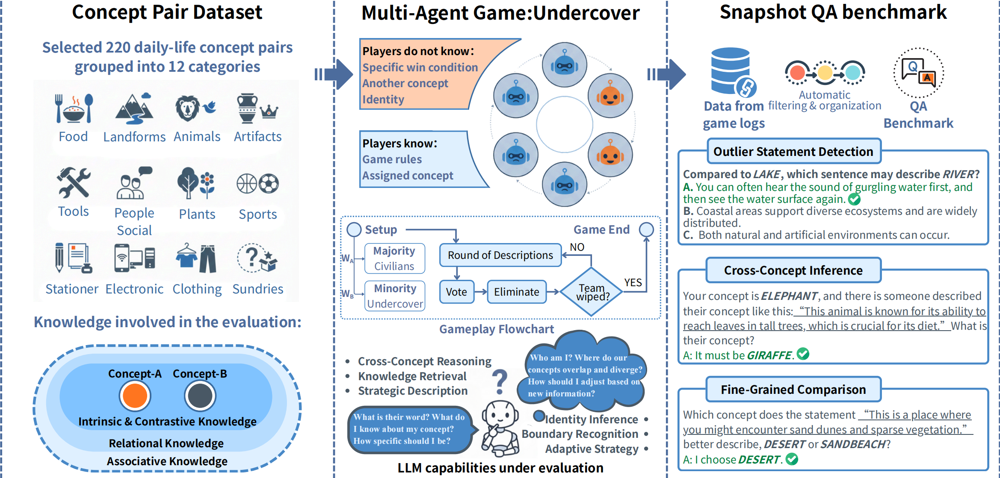
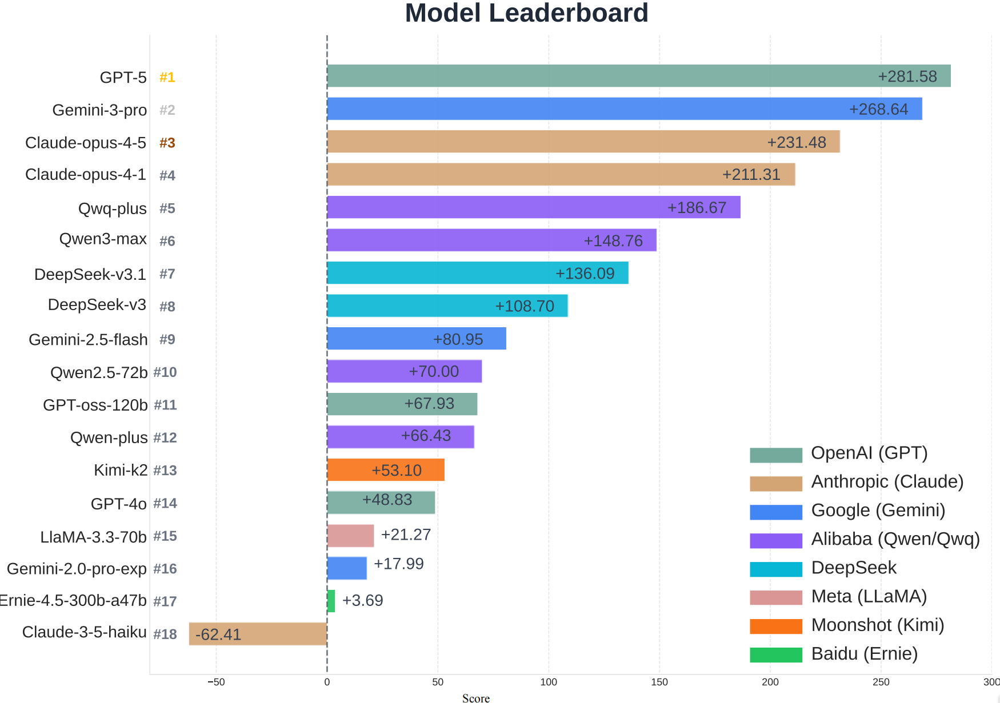

# CK-Arena

[](https://arxiv.org/abs/2505.17512)
[](https://ck-arena.site)
[](https://huggingface.co/datasets/Xushuhaha/CK-Arena)



## Introduction

CK-Arena is a multi-agent benchmark that evaluates whether large language models truly master concept knowledge. The benchmark uses a language-based social deduction game ("Undercover") where LLM players describe assigned concepts, and LLM judges score the statements. By comparing similar word pairs and tracking model performance over many games, CK-Arena produces a reliable ELO-based leaderboard of concept-level knowledge.

## Table of Contents

- [Dataset](#dataset)
- [Project Structure](#project-structure)
- [How to Start](#how-to-start)
- [Leaderboard](#leaderboard)
- [Citation](#citation)

## Dataset

### Overview

The dataset is hosted on HuggingFace: [Xushuhaha/CK-Arena](https://huggingface.co/datasets/Xushuhaha/CK-Arena).

It contains word pair lists organised by part of speech and semantic category, used as the concept vocabulary for gameplay.

### Word Pair Lists

Word pairs are stored in `data/word_list_1/en_628/` and organised by part of speech:

```
data/word_list_1/en_628/
├── adjective_100.json        # 100 adjective pairs
├── adverb_109.json           # 109 adverb pairs
├── verb_100.json             # 100 verb pairs
└── en_substaintive_noun_220/ # 220 substantive noun pairs split by category
    ├── Animals_16.json
    ├── Food_33_.json
    ├── Tools_19.json
    └── ...
```

Each JSON file is a list of two-element arrays, one pair per entry:

```json
[
  ["happy", "joyful"],
  ["angry", "furious"],
  ["sad", "melancholic"]
]
```

## Project Structure

```
CK-Arena/
├── undercover/
│   ├── agents/
│   │   ├── player_agent.py    # LLM-based player
│   │   ├── judge_agent.py     # LLM-based judge
│   │   ├── prompts.py         # Prompt templates for all supported languages
│   │   └── utils.py           # API call utilities
│   ├── game.py                # Core game logic and state management
│   ├── game_automated.py      # Automated mode using SFT and embedding models
│   ├── judge.py               # Abstract base class for judges
│   └── player.py              # Abstract base class for players
├── undercover_audience/
│   ├── agents/
│   │   ├── audience_agent.py  # LLM-based audience
│   │   ├── player_agent.py
│   │   ├── judge_agent.py
│   │   ├── prompts.py
│   │   └── utils.py
│   ├── game.py
│   ├── audience.py
│   ├── judge.py
│   └── player.py
├── data/
│   └── word_list_1/en_628/    # Word pair files by POS and category
├── docs/figure/               # Figures used in this README
├── logs/                      # Game records organised by language
├── main.py                    # Entry point for a single game
├── main_batch.py              # Batch game runner
└── rating.py                  # ELO rating calculator
```

## How to Start

### 1. Install Dependencies

```bash
pip install openai requests
```

### 2. Configure the API Client

All LLM calls go through `undercover/agents/utils.py`. Open the file and set your API credentials at the top:

```python
# undercover/agents/utils.py

OPENAI_API_KEY = "sk-..."          # your API key
OPENAI_BASE_URL = "https://..."    # base URL of any OpenAI-compatible endpoint
                                   # leave as None to use the official OpenAI API
```

The `call_api` function in that file uses the standard OpenAI Python SDK and works with any compatible provider (OpenAI, Azure, local servers, etc.).

If you plan to use **audience mode**, the same configuration must also be applied to `undercover_audience/agents/utils.py`. That file contains a stub `call_api` function with a `#TODO` marker — replace the body with the same implementation as in `undercover/agents/utils.py`:

```python
# undercover_audience/agents/utils.py

OPENAI_API_KEY = "sk-..."
OPENAI_BASE_URL = "https://..."

def call_api(llm_info):
    client = OpenAI(
        api_key=OPENAI_API_KEY or os.environ.get("OPENAI_API_KEY"),
        base_url=OPENAI_BASE_URL,
    )
    response = client.chat.completions.create(
        model=llm_info["model"],
        messages=llm_info["input_messages"],
        temperature=llm_info.get("temperature", llm_set["temperature"]),
        max_tokens=llm_info.get("max_tokens", llm_set["max_tokens"]),
    )
    ret = response.choices[0].message.content or ""
    # strip markdown code fences if present
    if '```json' in ret:
        s = ret.find('```json')
        s = ret.find('\n', s) + 1
        e = ret.find('```', s)
        if e != -1:
            ret = ret[s:e].strip()
    elif '```' in ret:
        s = ret.find('```') + 3
        e = ret.find('```', s)
        if s > 2 and e > s:
            ret = ret[s:e].strip()
    return ret.strip()
```

### 3. Configure `main.py`

Open `main.py` and edit the following variables:

```python
# Choose game mode
GAME_MODE = "standard"   # "standard": players vote | "audience": audience agent decides

# List of player models — each entry is [model_name, label]
player = [
    ["gpt-4o", ""],
    ["gpt-4o", ""],
    ["gpt-4o", ""],
]

# Judge model
judge = [
    ["gpt-4o", ""],
]

# Audience model (only used when GAME_MODE == "audience")
audience_llm = ["gpt-4o", ""]

# Path to a word-pair JSON file
data_path = "data/word_list_1/en_628/adjective_100.json"
```

Then adjust `game_settings` inside the loop as needed:

| Key | Description |
|---|---|
| `log_folder_path` | Base folder name for saving game logs |
| `topic_category` | Label for the word category (used in log path) |
| `pair` | Two-word pair drawn from the loaded JSON file |
| `civilian_count` | Number of civilian players |
| `undercover_count` | Number of undercover players |
| `max_statement_rounds` | Maximum statement rounds per game |
| `statements_per_voting` | Statement rounds between each vote |
| `language` | Game language (`en`, `zh`, `fr`, `ru`, `es`, `ja`, `ar`, `de`, `it`, `pt`) |

### 4. Run a Single Game

```bash
python main.py
```

Game records are saved under `logs/<log_folder_path>_<mode>/<language>/<topic_category>/`.

### 5. Run Batch Games

```bash
python main_batch.py
```

Edit `main_batch.py` to configure the number of games, concurrency, and which word-pair files to iterate over.

### 6. Calculate ELO Ratings

```bash
python rating.py
```

Reads all logs in `logs/` and outputs an ELO leaderboard for every model that participated.

## Leaderboard



*Last updated: March 2026*

## Citation

If you find this work useful, please cite:

```bibtex
@article{xu2025CKarena,
  title={Is Your LLM Really Mastering the Concept? A Multi-Agent Benchmark},
  author={Shuhang Xu and Weijian Deng and Yixuan Zhou and Fangwei Zhong},
  journal={arXiv preprint arXiv:2505.17512},
  year={2026}
}
```
