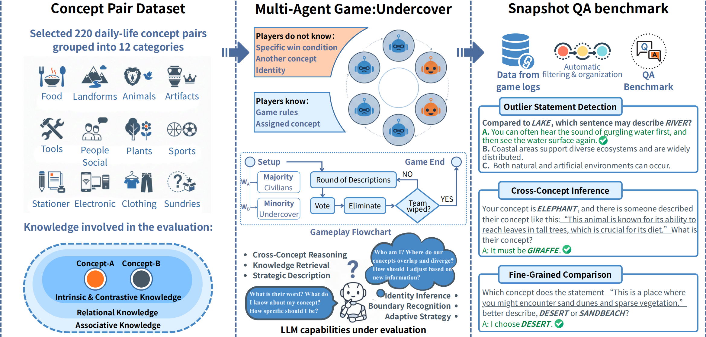
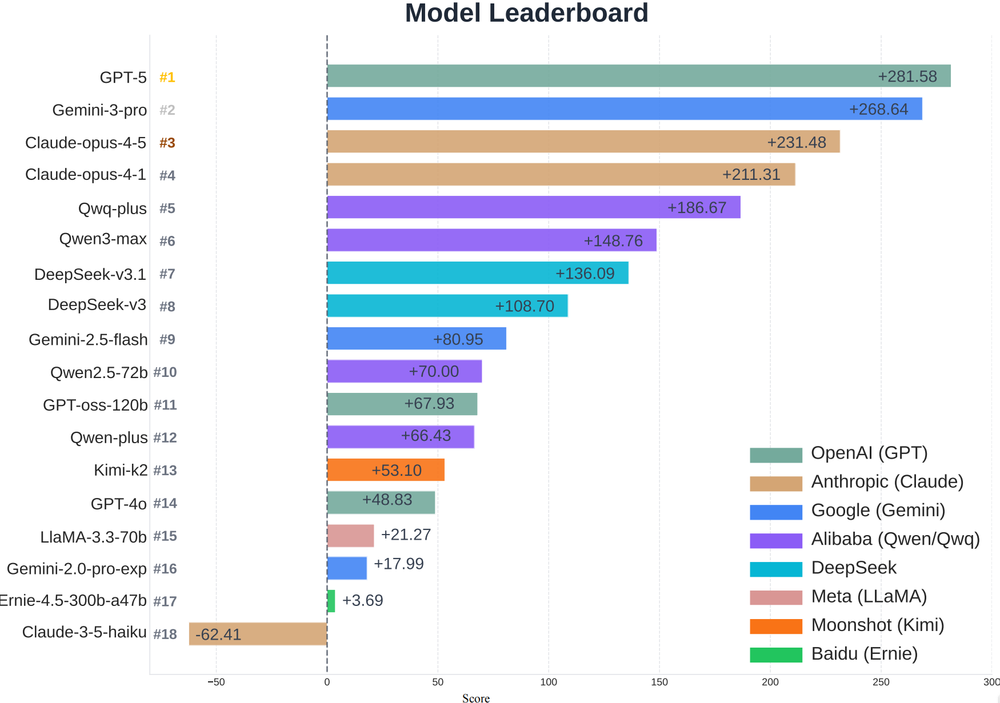

# CK-Arena

<p align="center">
  <a href="https://arxiv.org/abs/2505.17512"></a>
  <a href="https://ck-arena.site"></a>
  <a href="https://huggingface.co/datasets/Xushuhaha/CK-Arena"></a>
  
  
</p>

<p align="center">
  
</p>

---

## News

- **[2026-03]** Leaderboard updated with March 2026 results.
- **[2026-02]** Initial public release of CK-Arena with 628 English word pairs.
- **[2026-02]** Paper submitted to arXiv: [arXiv:2505.17512](https://arxiv.org/abs/2505.17512).

---

## Table of Contents

- [Leaderboard](#leaderboard)
- [Introduction](#introduction)
- [Dataset](#dataset)
- [Project Structure](#project-structure)
- [How to Start](#how-to-start)
- [Citation](#citation)
---

## Leaderboard

<p align="center">
  
</p>

*Last updated: March 2026*

---

## Introduction

CK-Arena is a multi-agent benchmark that evaluates whether large language models truly master concept knowledge. The benchmark uses a language-based social deduction game ("Undercover") where LLM players describe assigned concepts, and LLM judges score the statements. By comparing similar word pairs and tracking model performance over many games, CK-Arena produces a reliable ELO-based leaderboard of concept-level knowledge.

**Key features:**

- Multi-agent gameplay with LLM players and LLM judges
- 628 curated word pairs across adjectives, adverbs, verbs, and nouns
- ELO-based model leaderboard for reliable cross-model comparison
- Standard (player-vote) and audience (audience-agent-decides) game modes
- Compatible with any OpenAI-compatible API provider

---

## Dataset

The dataset is hosted on HuggingFace: [Xushuhaha/CK-Arena](https://huggingface.co/datasets/Xushuhaha/CK-Arena).

It contains word pair lists organised by part of speech and semantic category, used as the concept vocabulary for gameplay.

### Word Pair Lists

Word pairs are stored in `data/word_list_1/en_628/` and organised by part of speech:

```
data/word_list_1/en_628/
├── adjective_100.json        # 100 adjective pairs
├── adverb_109.json           # 109 adverb pairs
├── verb_100.json             # 100 verb pairs
└── en_substaintive_noun_220/ # 220 substantive noun pairs split by category
    ├── Animals_16.json
    ├── Food_33_.json
    ├── Tools_19.json
    └── ...
```

Each JSON file is a list of two-element arrays, one pair per entry:

```json
[
  ["happy", "joyful"],
  ["angry", "furious"],
  ["sad", "melancholic"]
]
```

---

## Project Structure

```
CK-Arena/
├── undercover/                        # Standard game mode
│   ├── agents/
│   │   ├── player_agent.py            # LLM-based player
│   │   ├── judge_agent.py             # LLM-based judge
│   │   ├── prompts.py                 # Prompt templates for all supported languages
│   │   └── utils.py                   # API call utilities
│   ├── game.py                        # Core game logic and state management
│   ├── game_automated.py              # Automated mode using SFT and embedding models
│   ├── judge.py                       # Abstract base class for judges
│   └── player.py                      # Abstract base class for players
├── undercover_audience/               # Audience game mode
│   ├── agents/
│   │   ├── audience_agent.py          # LLM-based audience
│   │   ├── player_agent.py
│   │   ├── judge_agent.py
│   │   ├── prompts.py
│   │   └── utils.py
│   ├── game.py
│   ├── audience.py
│   ├── judge.py
│   └── player.py
├── data/
│   └── word_list_1/en_628/            # Word pair files by POS and category
├── docs/figure/                       # Figures used in this README
├── logs/                              # Game records organised by language
├── main.py                            # Entry point for a single game
├── main_batch.py                      # Batch game runner
└── rating.py                          # ELO rating calculator
```

---

## How to Start

### Step 1 — Install Dependencies

```bash
pip install openai requests
```

### Step 2 — Configure the API Client

All LLM calls go through `undercover/agents/utils.py`. Open the file and set your API credentials at the top:

```python
# undercover/agents/utils.py

OPENAI_API_KEY = "sk-..."          # your API key
OPENAI_BASE_URL = "https://..."    # base URL of any OpenAI-compatible endpoint
                                   # leave as None to use the official OpenAI API
```

The `call_api` function uses the standard OpenAI Python SDK and works with any compatible provider (OpenAI, Azure, local servers, etc.).

> **Audience mode:** the same configuration must also be applied to `undercover_audience/agents/utils.py`. That file contains a stub `call_api` with a `#TODO` marker — replace the body with the same implementation shown above.

### Step 3 — Configure `main.py`

Open `main.py` and edit the following variables:

```python
# Choose game mode
GAME_MODE = "standard"   # "standard": players vote | "audience": audience agent decides

# List of player models — each entry is [model_name, label]
player = [
    ["gpt-4o", ""],
    ["gpt-4o", ""],
    ["gpt-4o", ""],
]

# Judge model
judge = [
    ["gpt-4o", ""],
]

# Audience model (only used when GAME_MODE == "audience")
audience_llm = ["gpt-4o", ""]

# Path to a word-pair JSON file
data_path = "data/word_list_1/en_628/adjective_100.json"
```

Then adjust `game_settings` inside the loop as needed:

| Key | Description |
|---|---|
| `log_folder_path` | Base folder name for saving game logs |
| `topic_category` | Label for the word category (used in log path) |
| `pair` | Two-word pair drawn from the loaded JSON file |
| `civilian_count` | Number of civilian players |
| `undercover_count` | Number of undercover players |
| `max_statement_rounds` | Maximum statement rounds per game |
| `statements_per_voting` | Statement rounds between each vote |
| `language` | Game language (`en`, `zh`, `fr`, `ru`, `es`, `ja`, `ar`, `de`, `it`, `pt`) |

### Step 4 — Run a Single Game

```bash
python main.py
```

Game records are saved under `logs/<log_folder_path>_<mode>/<language>/<topic_category>/`.

### Step 5 — Run Batch Games

```bash
python main_batch.py
```

Edit `main_batch.py` to configure the number of games, concurrency, and which word-pair files to iterate over.

### Step 6 — Calculate ELO Ratings

```bash
python rating.py
```

Reads all logs in `logs/` and outputs an ELO leaderboard for every model that participated.


---

## Citation

If you find this work useful, please cite:

```bibtex
@article{xu2025CKarena,
  title={Is Your LLM Really Mastering the Concept? A Multi-Agent Benchmark},
  author={Shuhang Xu and Weijian Deng and Yixuan Zhou and Fangwei Zhong},
  journal={arXiv preprint arXiv:2505.17512},
  year={2026}
}
```
